# Feishu Attachment Bridge Design

## Status

Accepted on 2026-07-25.

## Problem

Feishu media endpoints require authenticated requests from the browser extension. The
current implementation converts every downloaded image to a Base64 data URL and then
places all data URLs inside one Markdown string. Base64 expands the payload, runtime
messages and JavaScript strings create additional copies, and the final Obsidian
handoff still has to pass one large text value through the clipboard or an Obsidian
URI. Streaming and cancellation reduce the chance of a browser crash, but cannot make
large Base64 notes efficient.

## Requirements

### Functional

- Keep Feishu credentials and media download authorization inside the extension.
- Transfer image bytes without Base64 encoding.
- Write images as normal files inside the active Obsidian vault.
- Replace temporary media markers with portable Obsidian embeds.
- Support create, overwrite, append, and prepend note behaviors.
- Keep the existing link-only and small-document inline modes.
- Preserve the original Feishu document link when an image fails.
- Expose connection testing and clear progress/error messages.

### Non-functional

- Desktop-only companion plugin for Windows, macOS, and Linux.
- Bind only to `127.0.0.1`.
- Require a 32-byte pairing token; persist only its SHA-256 hash in the plugin.
- Default to two concurrent downloads, 20 MiB per image, and 512 MiB per transaction.
- Keep memory proportional to one or two images, not the full document.
- Abort expired transactions and clean temporary files.
- Never log Feishu credentials, media tokens, complete document identifiers, or the
  pairing token.
- Keep official upstream integration narrow and isolated under `src/platforms/feishu`.

## Architecture

```mermaid
flowchart LR
    A["Feishu document"] --> B["Platform extractor"]
    B --> C["Portable media markers"]
    C --> D["Popup save hook"]
    D --> E["Extension background bridge"]
    E --> F["Authenticated Feishu media fetch"]
    F --> G["Binary upload to 127.0.0.1"]
    G --> H["Desktop companion transaction"]
    H --> I["Temporary OS files"]
    I --> J["Vault.createBinary"]
    J --> K["Portable Markdown embeds"]
    K --> L["Vault note commit"]
```

### Browser extension

The Feishu Markdown stage emits markers such as
`` when bridge mode is enabled. The popup
continues to render and edit a lightweight note. On save, a Feishu-specific hook sends
the note, target path, behavior, and source URL to the extension background.

The background:

1. Validates the source URL, bridge endpoint, and pairing configuration.
2. Extracts and deduplicates media markers.
3. Starts a bridge transaction.
4. Downloads each Feishu image with the existing authenticated, bounded reader.
5. Uploads raw bytes to the companion without sending Feishu tokens to it.
6. Replaces each marker with the returned vault attachment path.
7. Commits the final Markdown note.
8. Aborts the transaction on any unrecoverable error.

Daily-note behaviors remain on the official clipboard path in version 1 because the
browser cannot safely infer a vault's daily-note path.

### Companion plugin

The companion is an Obsidian Desktop plugin named `Clipper Attachment Bridge`. It
starts a Node HTTP server only after the workspace layout is ready. The server accepts
authenticated requests on a configurable loopback port.

Each transaction owns an OS temporary directory. Asset request streams are written to
temporary files while enforcing size limits. During commit, the plugin creates missing
vault folders, reads one temporary file at a time, writes it with
`Vault.createBinary()`, substitutes attachment paths already resolved by the
extension, and creates or modifies the note with Vault APIs. A failed commit trashes
newly created vault assets and removes temporary files.

## Protocol

Protocol version: `1`.

- `GET /v1/health`
  - Requires Bearer authentication.
  - Returns protocol version, active vault name, and configured limits.
- `POST /v1/transactions`
  - Creates a transaction with note metadata and expected asset count.
- `PUT /v1/transactions/{id}/assets/{index}`
  - Accepts one binary asset and validated filename metadata.
  - Returns the reserved portable vault path.
- `POST /v1/transactions/{id}/commit`
  - Accepts the final Markdown string and commits assets plus note.
- `DELETE /v1/transactions/{id}`
  - Aborts and removes temporary data.

Responses use JSON envelopes with stable error codes. Request bodies are limited
before parsing. Transaction IDs and filenames are generated or normalized by the
receiver and are never accepted as arbitrary filesystem paths.

## Security

- The server rejects non-loopback socket addresses.
- Browser requests need a valid Bearer token.
- Plugin settings store only the token hash; regeneration invalidates the old token.
- CORS is restricted to extension origins and authenticated preflight requests.
- Note paths and attachment folders are normalized and reject absolute paths, `..`,
  null bytes, and writes inside the vault configuration directory.
- Temporary files are created below the operating system temp directory.
- Request and error logs contain counts and byte sizes only.
- Health responses do not disclose filesystem paths.

## Failure handling

| Failure | Behavior |
| --- | --- |
| Companion unavailable | Stop before downloads and show setup guidance |
| Vault mismatch | Reject transaction and show active/selected vault mismatch |
| Image exceeds limit | Preserve an original-document fallback and continue |
| Total limit exceeded | Stop starting new downloads and commit completed images plus fallbacks |
| Upload interrupted | Abort transaction and remove temporary files |
| Note commit fails | Trash assets created by that transaction and retain temporary diagnostics only in memory |
| Plugin unloads | Stop the server and abort all active transactions |
| Daily-note template | Use the existing official clipboard/URI path |

## Alternatives considered

### Native Messaging

Provides a strong binary channel, but requires an additional operating-system host
installer and per-browser registration. Rejected for version 1 because deployment and
upgrades would be substantially more complex.

### Downloadable ZIP bundle

Avoids Base64 and needs no Obsidian plugin, but users must manually import the folder
into a vault. Retained as a possible future fallback, not the primary workflow.

### Higher Base64 limits

Rejected because it amplifies memory use and note size without fixing the underlying
single-string clipboard transport.

## Acceptance criteria

- A fixture with at least 100 images uploads without Base64 media in runtime messages
  or the final note.
- Peak extension memory is bounded by configured concurrency times the per-image
  limit, excluding browser networking internals.
- A failed transaction leaves no committed note and no unreferenced new attachments.
- Existing non-Feishu clipping and Feishu link/inline modes keep working.
- A real authenticated Feishu document can be clipped into a dedicated test vault
  with every successful image represented by a portable vault embed.
